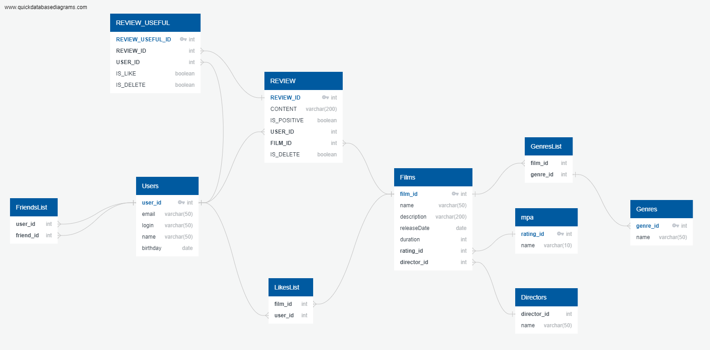

## Бэкенд учебного приложения "Online кинотеатр "Filmorate"

Рефакторинг и добавление новой функциональности в [базовый проект](https://github.com/Evgeny2835/Filmorate_11_single)

[Контрибьюторы](https://github.com/Shmakls/java-filmorate/graphs/contributors) в репозитории тимлида

### Стек технологий:
Java SE 11, Spring Boot, H.2, JDBC, Maven, Lombok, slf4j

### Функциональность
Онлайн кинотеатр, работающий с фильмами и оценками пользователей, возвращающий наиболее популярные фильмы

### Структура
Один сервис <br />
Хранение данных:
* в памяти приложения
* в базе данных H.2 версии 2.1.214 (в файле в папке 'db' проекта) <br />

Доступ к базе данных через JDBC

### Запуск:
* требуется среда разработки (при разработке использовалась IntelliJ IDEA 2022.2.3 (Ultimate Edition)
* через меню IntelliJ IDEA запустить FilmorateApplication (src/main/java/ru/yandex/practicum/filmorate)
  с помощью команды 'run'

### Визуализация результатов работы
[Postman коллекция](postman/sprint.json)

### ER диаграмма


### Основные операции:
  <details>
    <summary>
      добавление, обновление и получение информации о пользователях и фильмах  
    </summary>
    Пример кода:

    ```
     public User save(User user) {
        String insertSql = "INSERT INTO USERS (EMAIL, LOGIN, NAME, BIRTHDAY) VALUES (?, ?, ?, ?)";
        String selectSql = "SELECT USER_ID FROM USERS WHERE EMAIL = ?";
        jdbcTemplate.update(insertSql, user.getEmail(),
                user.getLogin(),
                user.getName(),
                user.getBirthday());
        SqlRowSet rs = jdbcTemplate.queryForRowSet(selectSql, user.getEmail());
        int id = 0;
        if (rs.next()) {
            id = rs.getInt("user_id");
        }
        user.setId(id);
        return user;
    }
    ```
  </details>

  <details>
    <summary>
      добавление в друзья, удаление из друзей, вывод списка общих друзей  
    </summary>
    Пример кода:

    ```
     public Collection<User> getCommonFriends(Long id, Long otherId) {
        return getFriends(id).stream()
                .filter(x -> getFriends(otherId).contains(x))
                .collect(Collectors.toList());
    }
    ```
  </details>

  <details>
    <summary>
      добавление и удаление лайка, вывод 10 наиболее популярных фильмов по количеству лайков  
    </summary>
    Пример кода:

    ```
    @Override
    public Collection<Film> getPopular(Long count) {
        return jdbcTemplate.query(
                SELECT_FROM_FILMS_LEFT_JOIN_GROUP_BY_ORDER_BY_DESC_LIMIT, (rs, rowNum) -> new Film(
                        rs.getLong("film_id"),
                        rs.getString("name"),
                        rs.getString("description"),
                        rs.getDate("releaseDate").toLocalDate(),
                        rs.getInt("duration"),
                        genreStorage.getFilmGenres(rs.getLong("film_id")),
                        mpaStorage.getMpa(rs.getInt("mpa_id")),
                        rs.getLong("rating")
                ), count);
    }
    ```
  </details>

  <details>
    <summary>
      получение списка всех жанров фильмов и по идентификатору  
    </summary>
    Пример кода:

    ```
    public Genre get(int id) {
        SqlRowSet userRows = jdbcTemplate.queryForRowSet(SELECT_NAME_FROM_GENRES_WHERE_GENRE_ID, id);
        if (userRows.next()) {
            Genre genre = new Genre(
                    id,
                    userRows.getString("name")
            );
            log.info("Genre found = {} ", genre);
            return genre;
        } else throw new ObjectNotFoundException(String.format("Genre not found: id=%d", id));
    }
    ```
  </details>

  <details>
  <summary>
    валидация фильмов и пользователей по определенным критериям  
  </summary>
    Пример кода:

    ```
    @PostMapping
    public Film add(@Valid @RequestBody Film film) {
        return filmService.add(film);
    }

    @Data
    @NoArgsConstructor
    public class Film {
        private Long id;
        @NotBlank
        private String name;
        @NotBlank
        @Size(max = 200)
        private String description;
        @NotNull
        @Past
        private LocalDate releaseDate;
        @NotNull
        @Positive
        private int duration;
        private Set<Long> likes = new LinkedHashSet<>();
        private Set<Genre> genres;
        @NotNull
        private Mpa mpa;
        private Long rate;
    }
    ```
  </details>

  <details>
    <summary>
      обработка ошибок  
    </summary>
    Пример кода:

    ```
    @RestControllerAdvice
    public class ErrorHandler {

      @ExceptionHandler
      @ResponseStatus(HttpStatus.BAD_REQUEST)
      public ErrorResponse handleValidationException(final ValidationException e) {
      return new ErrorResponse(e.getMessage());
      }
    }
    ```
  </details>